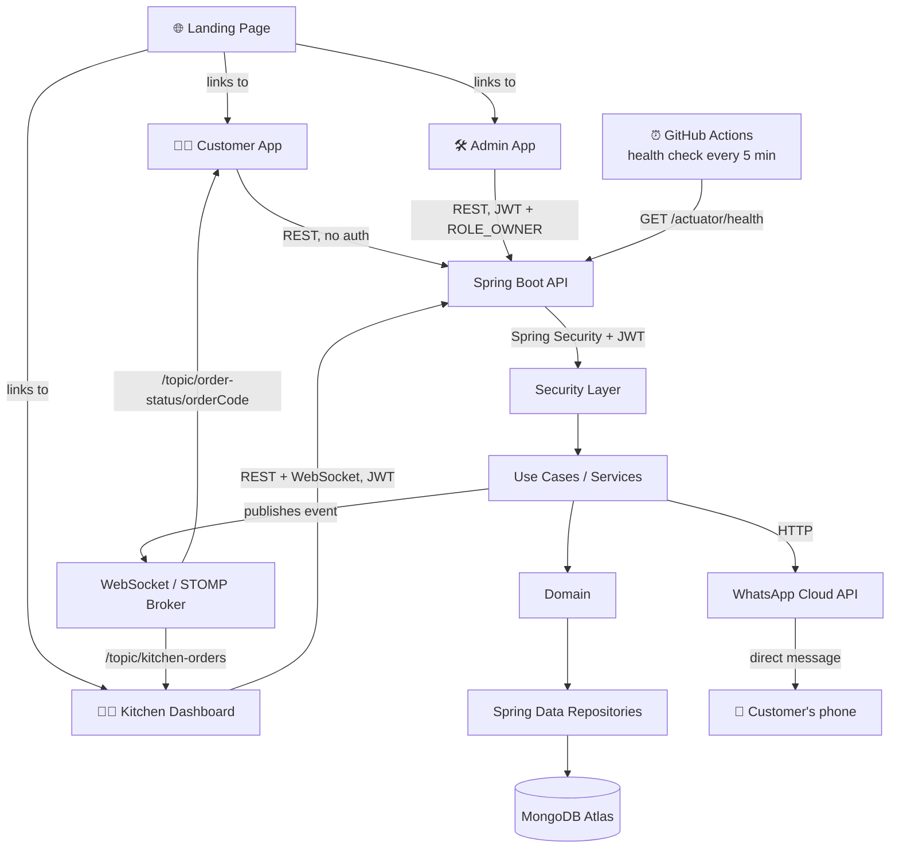
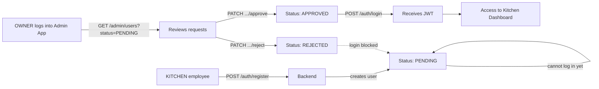
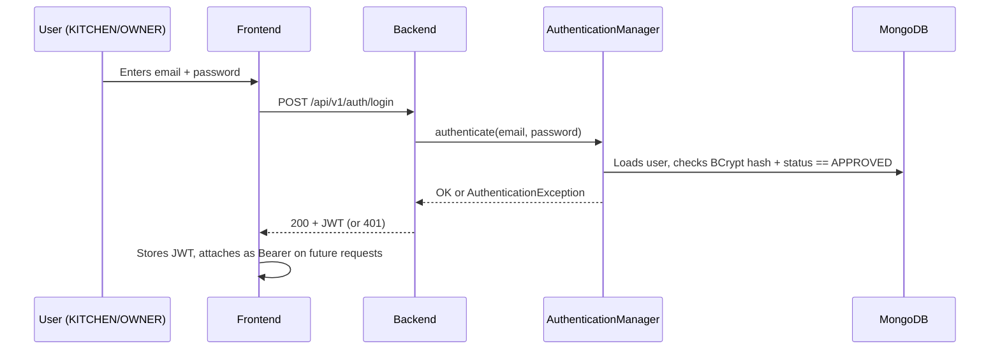
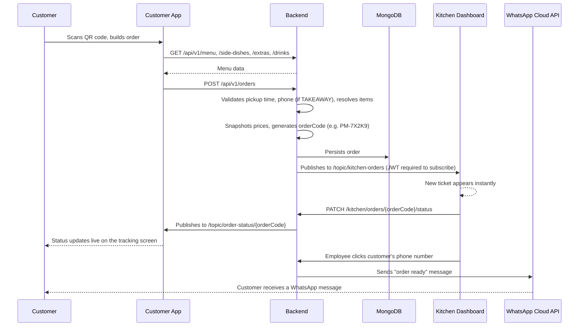

<div align="center">

# 🍽️ Pedacinhos de Maria

### Restaurant ordering & operations system - Java · Spring Boot · Spring Security (JWT) · MongoDB · WebSocket/STOMP

Digital menu via QR Code, real-time orders straight to the kitchen, role-based staff access with an internal approval flow, and a WhatsApp "order ready" notice - built for a real family restaurant.

</div>

---

## 📌 Table of Contents

- [About the project](#-about-the-project)
- [Demo](#-demo)
- [Architecture](#️-architecture)
- [Main flows](#-main-flows)
- [The four frontends](#-the-four-frontends)
- [Authentication & authorization](#-authentication--authorization)
- [Administration](#-administration)
- [Order flow](#-order-flow)
- [WebSocket / STOMP](#-websocket--stomp-real-time)
- [WhatsApp integration](#-whatsapp-integration)
- [Database](#️-database)
- [Security](#-security)
- [Technologies](#️-technologies)
- [Project structure](#-project-structure)
- [Software architecture](#-software-architecture)
- [Environment variables](#-environment-variables)
- [Running locally](#-running-locally)
- [Docker](#-docker)
- [Tests](#-tests)
- [Deploy](#-deploy)
- [Technical decisions](#-technical-decisions)
- [Challenges & evolution](#-challenges--evolution)
- [Next improvements](#-next-improvements)
- [Author](#-author)

---

## 🎯 About the project

**Pedacinhos de Maria** was born from a real, specific problem: a small family restaurant having to explain, every single day, the same menu to every customer who walked in — updating a chalkboard by the door, repeating "today we have this, we don't have that" dozens of times.

The system digitizes that flow end-to-end. The customer scans a QR code, builds an order — main dish, side dish, extras, drinks — and it lands **in real time** on the kitchen's dashboard. It has since grown beyond the ordering flow itself into a small internal operations system: kitchen staff now have their own accounts, and access to the dashboard is gated behind an approval step controlled by the restaurant's owner.

Four coordinated pieces make up the system today:

| Piece | Audience | Responsibility |
|---|---|---|
| 🌐 **Landing Page** | Public | Entry point with links to the other three apps |
| 🧑‍🍳 **Customer App** | Customers | Menu, order building, live status tracking — no login |
| 👨‍🍳 **Kitchen Dashboard** | Kitchen staff | Order queue, status control, prep timer — requires an approved account |
| 🛠️ **Admin App** | Owner | Approve/reject staff accounts — requires the OWNER role |
| ⚙️ **Backend** | — | Business rules, persistence, authentication, real time, WhatsApp notification |

This README documents the system **as it exists in the current codebase**, not as originally planned — sections describing a removed or superseded mechanism have been updated accordingly (see [Challenges & evolution](#-challenges--evolution)).

---

## 🎥 Demo

| Customer App | Kitchen Dashboard |
|---|---|
|  |  |

---

## 🏗️ Architecture



- **Four independent static frontends** (Landing, Customer, Kitchen, Admin) — plain HTML/CSS/JS, no framework, no build step, each deployed as its own Render Static Site.
- **Backend is a single Spring Boot application** — a modular monolith organized by feature (`modules/auth`, `modules/menu`, `modules/order`), not a set of independently deployed services. The project's actual volume (one restaurant, a small kitchen staff) doesn't justify the operational cost of microservices, and nothing in the codebase is structured as one.
- **MongoDB Atlas** is the single database, in every environment — no local instance.
- **Spring Security + JWT** protects the Kitchen Dashboard and Admin App; the Customer App remains intentionally unauthenticated (see [Technical decisions](#-technical-decisions)).
- **WebSocket (STOMP)** pushes new orders and status changes to the kitchen instantly, and notifies the customer's own tracking screen when their order's status changes.
- **WhatsApp Cloud API** is a separate, manually triggered channel: a kitchen employee clicks the customer's phone number on the ticket to send a "your order is ready" message, independent of the WebSocket update.
- **GitHub Actions** runs a scheduled health check against the backend to mitigate Render's free-tier cold start (see [Deploy](#-deploy)).

---

## 🔄 Main flows

### Staff registration & approval



There is no external step in this flow anymore — no WhatsApp message, no token, no third party. Approval is an in-app action performed by an authenticated OWNER (see [Challenges & evolution](#-challenges--evolution) for what this replaced).

### Authentication



A `PENDING` or `REJECTED` user fails authentication with the same generic `401` as a wrong password — the API never reveals which check failed.

### Order flow



---

## 🌐 The four frontends

### Landing Page
Public entry point. Its only logic is resolving and wiring the three other apps' URLs (`customer`, `kitchen`, `admin`) based on whether it's running locally or in production, plus a simple mobile nav toggle. No API calls of its own.

### Customer App
- Loads the menu dynamically (dishes, side dishes, extras, drinks) — nothing hardcoded.
- Order wizard: dish → side dish (only if the dish's `requiresSideDish` flag is true) → extras → drinks → customer details.
- Estimated total shown client-side for UX only; the backend recalculates and persists the authoritative total.
- Receives an `orderCode` (e.g. `PM-7X2K9`) on creation and subscribes to its own WebSocket topic to track status live — no login required, by design.

### Kitchen Dashboard
- Now sits behind a login screen (`authGate.js` / `authApi.js`) — an unapproved or logged-out visitor is redirected before the board ever loads.
- Board with columns per order status, fed in real time over the authenticated WebSocket topic.
- Ticket shows dish, side dish, extras, drinks, and the customer's phone number as a clickable action that triggers the WhatsApp "ready" message.
- Prep timer color (green/yellow/red) is computed entirely server-side (see [Technical decisions](#-technical-decisions)).

### Admin App
- Exclusive to the `OWNER` role — its own login screen and session guard (`adminGate.js`).
- Lists staff accounts with a status filter (`PENDING` / `APPROVED` / `REJECTED`).
- Approve/reject actions call the backend directly; the frontend holds no authorization logic of its own — the backend is the sole authority (see [Security](#-security)).

---

## 🔐 Authentication & authorization

The Kitchen Dashboard and Admin App require an account; the Customer App never does — that split is a deliberate, unchanged product decision (see [Technical decisions](#-technical-decisions)).

**Roles**
- `KITCHEN` — restaurant staff, gains dashboard access once approved.
- `OWNER` — the restaurant's owner; the only role that can approve/reject staff accounts and access `/api/v1/admin/**`.

**Account status**
- `PENDING` — default state on self-registration; cannot log in.
- `APPROVED` — set by an OWNER; can log in and receive a JWT.
- `REJECTED` — set by an OWNER; login stays blocked.

Nothing in `RegisterUserUseCase` accepts a role from the request — every public sign-up is hardcoded to `KITCHEN` + `PENDING`. The only way an `OWNER` account exists is the seeder described below.

**Enforcement (confirmed in `SecurityConfig`)**

| Route | Access |
|---|---|
| `/api/v1/menu/**`, `/side-dishes/**`, `/extras/**`, `/drinks/**` | Public |
| `/api/v1/orders/**` (create, query, pickup-time-policy) | Public |
| `POST /api/v1/orders/{code}/whatsapp-ready-message` | `KITCHEN` or `OWNER` |
| `POST /api/v1/auth/register`, `POST /api/v1/auth/login` | Public |
| `/api/v1/kitchen/**` | `KITCHEN` or `OWNER` |
| `/api/v1/admin/**` | `OWNER` only |
| `/ws/**`, `/ws-sockjs/**` | Public (auth handled at the STOMP level, see below) |
| Anything else | Denied by default (`anyRequest().denyAll()`) |

Password checks and status checks (`PENDING`/`REJECTED` blocked) are delegated entirely to Spring Security's own `AuthenticationManager` — the codebase doesn't hand-roll credential comparison. Failed authentication always returns a generic `401` regardless of cause, to avoid leaking which accounts exist.

### OWNER Seeder

The first `OWNER` account is never created through the public registration endpoint — it's provisioned by `OwnerSeeder`, an `ApplicationRunner` that executes on startup:

1. If any `OWNER` already exists in the database, it does nothing (idempotent — it never overwrites an existing OWNER's credentials, even if the environment variables change later).
2. Otherwise, if `OWNER_EMAIL` and `OWNER_PASSWORD` are set, it creates one OWNER account with a BCrypt-hashed password, born already `APPROVED`.
3. If those variables are missing, it logs a warning and lets the application boot normally — the admin panel simply stays inaccessible until they're configured and the app restarts.

---

## 🛡️ Administration

Endpoints under `/api/v1/admin/users`, protected by `hasRole("OWNER")` at the `SecurityConfig` level (the controller itself performs no additional role check):

| Method & path | Purpose |
|---|---|
| `GET /api/v1/admin/users` | List users, optional `?status=PENDING\|APPROVED\|REJECTED` filter |
| `PATCH /api/v1/admin/users/{id}/approve` | `PENDING → APPROVED` |
| `PATCH /api/v1/admin/users/{id}/reject` | `PENDING → REJECTED` |

Both transitions only accept a user currently in `PENDING` — approving or rejecting an already-processed user throws `UserAlreadyProcessedException`, which prevents double-processing (e.g., a double click) without needing a single-use token.

---

## 🔄 Order flow

Full request chain, as implemented in `CreateOrderUseCase`:

1. Customer submits dish, optional side dish, extras, drinks, pickup time, order type (`DINE_IN`/`TAKEAWAY`), payment method (informational only — no payment is processed).
2. Backend validates: pickup time falls within `11:00–15:30` (São Paulo timezone) and isn't in the past; a phone number is required and normalized for `TAKEAWAY` orders.
3. Each selected item (meal, side dish, extras, drinks) is resolved and its **price is snapshotted** onto the order — if the menu price changes later, orders already placed keep the price they were created with.
4. A unique `orderCode` is generated (see below) and the order is persisted with status `RECEIVED`.
5. `OrderEventPublisher` broadcasts the new order to `/topic/kitchen-orders`.
6. The kitchen moves the order through `RECEIVED → PREPARING → READY → DELIVERED` (or `CANCELLED`, only before delivery) — every transition is validated against an explicit allow-list defined on the `OrderStatus` enum itself.
7. Each status change is published both to the kitchen topic and to the customer's own `/topic/order-status/{orderCode}`.

**Order code**: 5 random base36 characters prefixed with `PM-` (e.g. `PM-7X2K9`), generated with `SecureRandom` — not sequential, not incremental. It works as a capability token: whoever holds the code can read that one order's status without logging in. ~36⁵ (≈60 million) combinations is enough to avoid accidental guesses for this restaurant's daily volume, while staying short enough to read aloud at the counter; see [WebSocket / STOMP](#-websocket--stomp-real-time) for how repeated-guessing is mitigated separately.

**Prep timer**: never computed in the browser. `OrderTimerService` scans active orders (`RECEIVED`/`PREPARING`) every 15 seconds and derives a `GREEN`/`YELLOW`/`RED` state from `createdAt` + the meal's snapshotted prep time; `TimerState` is never persisted, so a dashboard reload can never show a stale value.

---

## 🔌 WebSocket / STOMP (real time)

Two STOMP endpoints are exposed: `/ws` (native WebSocket, consumed by the frontends' hand-written STOMP client) and `/ws-sockjs` (same broker, with a SockJS fallback).

**Authentication at CONNECT is optional**, by design: a client that never sends an `Authorization` header (the Customer App, which never logs in) connects as anonymous. A client that *does* send one with an invalid or expired JWT is rejected outright.

**Authorization happens at SUBSCRIBE, per destination**, enforced by `StompAuthChannelInterceptor`:

| Topic | Rule |
|---|---|
| `/topic/kitchen-orders` | Requires the session to have authenticated at CONNECT with role `KITCHEN` or `OWNER` |
| `/topic/order-status/{orderCode}` | No login required, but limited to **3 distinct order topics per STOMP session** |

The subscription limit exists because the order code's ~26 bits of entropy resist accidental guessing, but not an automated scan over an already-open STOMP connection (which can attempt many `SUBSCRIBE`s per second with no per-attempt HTTP round-trip cost). A legitimate customer subscribes to exactly one order topic per session; the limit is the practical defense against enumeration, without requiring the customer to log in or lengthening the code itself.

---

## 📲 WhatsApp integration

Independent of the automatic WebSocket status update, an employee can manually trigger a WhatsApp message from the Kitchen Dashboard by clicking the customer's phone number on the ticket.

**Endpoint**: `POST /api/v1/orders/{orderCode}/whatsapp-ready-message` — requires `KITCHEN` or `OWNER` (see [Authentication & authorization](#-authentication--authorization)).

**Port/Adapter, same pattern used across the rest of the backend**:

```
Controller → Use Case → WhatsAppMessageSender (Port, interface) → WhatsAppCloudApiMessageSender (Adapter) → WhatsApp Cloud API
```

`SendOrderReadyWhatsAppMessageUseCase` looks up the order, requires a phone number to be on file (throws `PhoneNumberNotAvailableException` otherwise — e.g. a `DINE_IN` order never requires one), and delegates sending to the port. The concrete adapter talks to Meta's WhatsApp Cloud API directly via `RestTemplate`, with no third-party SDK. Swapping providers later (Twilio, Z-API, etc.) means writing a new class that implements the same interface — no use case or controller changes.

A failure to reach the Cloud API is logged, not propagated as an error to the employee who clicked — they already saw the action fire; a momentary hiccup from the external provider shouldn't block the kitchen's workflow.

This is entirely separate from — and unrelated to — the **old** WhatsApp-based user-approval flow, which has been fully removed from the codebase (see [Challenges & evolution](#-challenges--evolution)).

---

## 🗄️ Database

MongoDB Atlas, single database across all environments. Collections confirmed in the code:

| Collection | Content | Notable indexes |
|---|---|---|
| `meals` | Main dishes (fixed + dish of the day) | Compound index on `active` + `displayOrder` |
| `side_dishes` | Side dish options | Same pattern as `meals` |
| `extras` | Extra items | Same pattern as `meals` |
| `drinks` | Drinks | — |
| `orders` | Orders, with price/name snapshots per item | Unique index on `order_code`; **TTL index** on `createdAt` |
| `users` | Kitchen/Owner accounts | Unique index on `email` |

Indexes are created and kept in sync explicitly by `MongoIndexInitializer` on startup (`auto-index-creation` is disabled) — including adjusting the TTL index's `expireAfterSeconds` via `collMod` if `ORDER_RETENTION_DAYS` changes, with no need to drop and recreate the index.

**Order images**: menu item images are plain relative paths served by the Customer App's own static assets (`customer-app/uploads/images/...`), not URLs to an external object store. This is a **reverted** decision — an earlier attempt used Amazon S3, rolled back because no AWS account was available for the project at the time (see [Technical decisions](#-technical-decisions)). MongoDB never stores binary or base64 image data.

---

## 🔒 Security

Confirmed in `SecurityConfig` and related classes:

- **Spring Security + JWT** (`io.jsonwebtoken`) — stateless sessions (`SessionCreationPolicy.STATELESS`), no server-side session store.
- **BCrypt** password hashing (`BCryptPasswordEncoder`) — the only password-related bean in the project.
- **CSRF disabled** — appropriate for a stateless, token-based API with no cookie-based session.
- **Anonymous authentication explicitly disabled** — without this, Spring Security's default `AnonymousAuthenticationFilter` made an unauthenticated request to a protected route look "authenticated but wrong role" (`403`) instead of "not authenticated" (`401`); this was an actual bug found and fixed during development.
- **Explicit `AuthenticationEntryPoint`** — returns a minimal JSON `401` body directly, since security filters run before Spring MVC's own exception handling.
- **Security headers**: `X-Frame-Options: DENY`, `X-Content-Type-Options`, a `Strict-Origin-When-Cross-Origin` referrer policy, and a restrictive `Permissions-Policy` (camera/microphone/geolocation all denied).
- **CORS** origins come exclusively from `CORS_ALLOWED_ORIGINS` (`app.cors.allowed-origins`) — there is no hardcoded domain in the Java code; methods and headers stay wildcarded, a conscious trade-off since credentials are not enabled and the origin check is what actually gates access.
- **WebSocket/STOMP authorization** — see the dedicated section above.
- **Order code as capability token** and **STOMP subscription throttling** — see above.
- **No credentials in source** — `MONGODB_URI`, `JWT_SECRET`, `OWNER_PASSWORD`, and the WhatsApp credentials all come from environment variables with no default value baked into the code; the `prod` profile file is deliberately empty of secrets.
- **No rate limiting yet** on the public order-creation endpoint — the only current protection is business-rule validation inside `CreateOrderUseCase`; this is a known, accepted gap for a future hardening phase, not an oversight (see [Next improvements](#-next-improvements)).

---

## 🛠️ Technologies

### Backend

| Technology | Version | Use |
|---|---|---|
| Java | 21 | Language |
| Spring Boot | 3.3.4 | Application framework |
| Spring Security | (Boot-managed) | Authentication & authorization |
| Spring Data MongoDB | (Boot-managed) | Persistence |
| Spring WebSocket + STOMP | (Boot-managed) | Real-time communication |
| Spring Validation | (Boot-managed) | Request validation |
| Spring Boot Actuator | (Boot-managed) | `/actuator/health` for uptime checks |
| springdoc-openapi (Swagger UI) | 2.6.0 | API documentation |
| jjwt (`io.jsonwebtoken`) | 0.12.6 | JWT generation/validation |
| MapStruct | 1.6.2 | Entity ↔ DTO mapping |
| Lombok | 1.18.42 | Boilerplate reduction |
| Maven | — | Build tool |

### Frontend (×4 apps)

| Technology | Use |
|---|---|
| HTML5 | Structure |
| CSS3 | Styling, no framework |
| JavaScript (ES6+, native modules) | All client-side logic, no bundler, no framework |

### External integrations

| Technology | Use |
|---|---|
| WhatsApp Cloud API (Meta) | Manually triggered "order ready" message |

### Infrastructure

| Technology | Use |
|---|---|
| Docker | Multi-stage backend image |
| Render | Hosting for backend (Docker web service) + 4 static frontends |
| MongoDB Atlas | Managed database |
| GitHub Actions | Scheduled keep-alive health check |

---

## 📁 Project structure

```text
pedacinho-de-maria/
├── pom.xml                         # Backend lives at the repository root
├── Dockerfile
├── docker-compose.yaml
├── render.yaml
├── .github/workflows/keep-render-awake.yml
├── src/
│   ├── main/java/com/pedacinhodemaria/
│   │   ├── config/                 # Security, WebSocket, Mongo indexes, Owner seeder, OpenAPI
│   │   ├── modules/
│   │   │   ├── auth/                # User, roles, JWT, registration & approval use cases
│   │   │   ├── menu/                 # Meal, SideDish, Extra, Drink (read-only API)
│   │   │   └── order/                 # Order, timer, WebSocket publisher, WhatsApp use case
│   │   └── shared/                    # Cross-cutting exceptions and DTOs (ApiError, GlobalExceptionHandler)
│   ├── main/resources/
│   │   ├── application.yml           # Shared config, all secrets via env vars
│   │   ├── application-dev.yml
│   │   └── application-prod.yml
│   └── test/java/com/pedacinhodemaria/  # JUnit 5 + Mockito tests, mirrors the module structure
└── pedacinho-frontend/
    ├── landing-page/
    ├── customer-app/
    ├── kitchen-dashboard/
    └── admin/
```

> **Note on `render.yaml`'s own comment**: it instructs setting the Render service's "Root Directory" to `pedacinho-backend`, which doesn't match the current layout — the backend (`pom.xml`, `src/`) lives directly at the repository root, with `pedacinho-frontend/` as a sibling folder. This appears to be a leftover from an earlier layout; the Root Directory in Render should be left at the repository root for this to build correctly today.

---

## 🧱 Software architecture

The backend is organized **feature-first** (`modules/auth`, `modules/menu`, `modules/order`), each with its own internal layering, rather than one global technical-layer split across the whole application:

```
Controller  →  Use Case / Service  →  Repository  →  MongoDB
                      ↓
                 Domain (entities, enums with behavior, e.g. OrderStatus)
```

- **Controller**: request/response only, no business logic — confirmed across every controller in the codebase (e.g. `AdminUserController`'s own Javadoc states it re-verifies nothing, trusting `SecurityConfig` entirely for authorization).
- **Use Case / Service**: one class per business operation (`ApproveUserUseCase`, `CreateOrderUseCase`, `SendOrderReadyWhatsAppMessageUseCase`...) — this is a use-case-per-class style, not a formal Clean Architecture with dedicated ports/adapters at every boundary. The one place that *does* follow an explicit Port/Adapter split is the WhatsApp integration (see below), by deliberate choice, not as a project-wide rule.
- **Domain**: some behavior lives directly on enums — `OrderStatus` encodes its own allowed transitions (`canTransitionTo`), so no other class in the codebase can silently accept an invalid state jump.
- **Repository**: Spring Data MongoDB interfaces, no manual/concatenated queries.

**External integration boundary** (WhatsApp) is the one place with an explicit named Port:

```
Controller  →  Use Case  →  Port (WhatsAppMessageSender)  →  Adapter (WhatsAppCloudApiMessageSender)  →  WhatsApp Cloud API
```

The Use Case depends only on the interface — switching providers means writing a new Adapter, with zero changes to the Use Case or Controller.

This is not described as "Clean Architecture", "microservices", or "enterprise architecture" anywhere in this document on purpose — the codebase doesn't have the layered ports/adapters structure or the deployment topology those labels imply; what it has is a straightforward, consistent separation of concerns inside a single Spring Boot application.

---

## 🔐 Environment variables

```env
# MongoDB Atlas connection string (mongodb+srv://...) — required in every environment
MONGODB_URI=

# Backend port — Render injects this automatically; falls back to SERVER_PORT, then 8080
PORT=

# Comma-separated list of allowed frontend origins for CORS + WebSocket
CORS_ALLOWED_ORIGINS=

# dev or prod
SPRING_PROFILES_ACTIVE=

# Days until an order is automatically deleted via MongoDB's TTL index
ORDER_RETENTION_DAYS=

# Signing secret for JWTs — required, no default
JWT_SECRET=

# JWT lifetime in milliseconds (defaults to 3600000 / 1 hour if unset)
JWT_EXPIRATION_MS=

# WhatsApp Cloud API — optional; without them, only the "order ready" WhatsApp
# trigger is inoperative, the rest of the app boots normally
WHATSAPP_API_URL=
WHATSAPP_PHONE_NUMBER_ID=
WHATSAPP_ACCESS_TOKEN=

# Initial OWNER account, created once by OwnerSeeder if no OWNER exists yet
OWNER_EMAIL=
OWNER_PASSWORD=
OWNER_NAME=
```

No real credential, secret, or connection string is included anywhere in this repository or this README — every value above is a name to fill in per environment.

---

## 💻 Running locally

### Backend

```bash
# from the repository root
./mvnw clean test
./mvnw clean verify
./mvnw spring-boot:run
```

### Frontends

Each is a static app with no build step — serve them with any static HTTP server, from their own folder:

```bash
cd pedacinho-frontend/customer-app && python3 -m http.server 5500
cd pedacinho-frontend/kitchen-dashboard && python3 -m http.server 5501
cd pedacinho-frontend/admin && python3 -m http.server 5502
```

> Don't open the `.html` files directly as local files (`file://`) — these are ES6 modules and require an HTTP server. Ports `5500`/`5501`/`8081` are the ones already whitelisted in the default local CORS configuration (`application.yml`); if you serve the Admin App on a different port, add it to `CORS_ALLOWED_ORIGINS`.

---

## 🐳 Docker

```bash
docker compose up --build
```

- Multi-stage `Dockerfile`: a `maven:3.9-eclipse-temurin-21` build stage produces the JAR; the final image is `eclipse-temurin:21-jre-alpine` — only the JRE and the JAR ship to production, keeping the image small.
- Runs as a **non-root user** (`spring`) inside the container.
- `HEALTHCHECK` polls `/actuator/health` on the port the app is actually listening on.
- `docker-compose.yaml` starts the backend only — no local MongoDB container, since the project always talks to MongoDB Atlas; `MONGODB_URI` must be exported in your shell or `.env` before running.
- `.dockerignore` explicitly excludes `pedacinho-frontend/`, keeping the Docker build context to just `pom.xml` and `src/`.

---

## ✅ Tests

The suite uses **JUnit 5 + Mockito**, with **MockMvc in standalone mode** for controller-level tests (no full Spring context boot) and dedicated security tests (`AdminUserControllerSecurityTest`, `KitchenOrderControllerSecurityTest`, `StompAuthChannelInterceptorTest`) that specifically exercise role/authentication enforcement rather than only happy-path business logic.

Coverage, by module:

- **Auth**: registration, login, approve/reject transitions, the OWNER seeder's idempotency, JWT generation/parsing, and role-based access to admin/kitchen routes.
- **Order**: order creation (including validation failures), pickup-time policy, the prep-timer state machine, order status transitions, and the order mapper.
- **Menu**: menu, side dish, and extra retrieval services.
- **WebSocket**: STOMP CONNECT/SUBSCRIBE authorization and the per-session subscription limit.

---

## 🚀 Deploy

| Component | Where |
|---|---|
| Backend | Render — Web Service (Docker), `render.yaml` blueprint |
| Landing Page | Render — Static Site (`https://pedacinhos-de-maria.onrender.com/`) |
| Customer App | Render — Static Site (`https://pedacinho-customer.onrender.com/`) |
| Kitchen Dashboard | Render — Static Site (`https://pedacinho-dashboard.onrender.com/`) |
| Admin App | Render — Static Site (`https://pedacinho-admin.onrender.com/`) |
| Backend production URL | `https://pedacinho-de-maria.onrender.com/` |
| Database | MongoDB Atlas |

`render.yaml` only automates the **backend** service; the four static frontends are configured as separate Static Sites on Render (their production hostnames are hardcoded into each app's own `config.js`/`app.js`, matched against `window.location.hostname` to decide between local and production API URLs).

### 🩺 Keep-alive strategy (cold start mitigation)

Confirmed in `.github/workflows/keep-render-awake.yml`: a scheduled GitHub Actions workflow pings the backend roughly every 5 minutes:

```yaml
on:
  schedule:
    - cron: "*/5 * * * *"
  workflow_dispatch:
```

```bash
curl --silent --show-error --fail \
  --retry 5 --retry-delay 15 --retry-all-errors --max-time 120 \
  https://pedacinho-de-maria.onrender.com/actuator/health
```

This reduces (does not eliminate) the chance that an actual customer is the one who triggers Render's free-tier cold start after a period of inactivity. If the workflow doesn't run for any reason, the backend keeps working exactly as before — it just goes back to depending on Render's own cold-start behavior for the very first request after idling.

---

## 🧭 Technical decisions

| Problem | Decision | Reasoning | Result |
|---|---|---|---|
| Approving new kitchen staff required a manual, external step | Removed the previous WhatsApp/token-based approval and replaced it with an in-app `PENDING → APPROVED/REJECTED` flow driven by an authenticated `OWNER` | Keeps the entire decision (and its audit trail — `updatedAt`, who has access) inside the system itself, with no dependency on a third-party channel being available or the token being intercepted | A `PENDING` user cannot log in until an `OWNER` explicitly acts inside the Admin App; no external message is sent or required |
| Who is allowed to become `OWNER`? | Self-registration always creates `KITCHEN` + `PENDING`; the only `OWNER` account is created by `OwnerSeeder` from environment variables at boot | Prevents any form of privilege escalation through the public registration endpoint | The first (and typically only) `OWNER` is provisioned once, outside the public API surface |
| Menu images were originally planned to live in Amazon S3 | Reverted to serving images as static assets shipped with the Customer App frontend | No AWS account was available for the project | `Meal.imageUrl` (and the equivalent fields on other menu items) store a relative path, never an external object-store URL |
| Kitchen prep timers must stay accurate across page reloads and disconnects | Timer state (`GREEN`/`YELLOW`/`RED`) is computed entirely server-side from `createdAt` + snapshot prep time, on a 15-second scheduled scan, and is never persisted | A `setInterval` in the browser loses its reference point on reload or a dropped connection | Reopening the Kitchen Dashboard always shows the correct, currently-accurate timer state with no client-side recalculation logic |
| The customer must never need to create an account | Customer App stays fully unauthenticated end-to-end; the order code is used as a lightweight capability token instead | Login friction for a walk-in restaurant customer defeats the purpose of a fast QR-code order | Anyone can create and track an order without ever signing up, while still requiring the random order code to read its status |
| An open WebSocket connection could be used to brute-force order codes faster than an HTTP-based attack | `StompAuthChannelInterceptor` limits each STOMP session to 3 distinct order-topic subscriptions | The order code's ~26 bits of entropy resist accidental discovery but not an unthrottled automated scan over a single open connection | A legitimate customer session, which only ever subscribes to its own order topic once, is unaffected; a scripted scan hits the limit almost immediately |
| CORS previously accepted any origin (`*`) regardless of configuration | `SecurityConfig`'s CORS source now reads exclusively from the `CORS_ALLOWED_ORIGINS` environment variable, with no hardcoded fallback domain in the Java code | An audit found the wildcard default was silently overriding the configured allow-list | Only origins explicitly configured per environment can call the API or open a WebSocket connection |
| An unauthenticated request to a protected route was returning `403` instead of `401` | Disabled Spring Security's default anonymous authentication filter (`.anonymous(AbstractHttpConfigurer::disable)`) | The anonymous filter was populating the security context with a token for every request, which made the authorization filter treat "no credential" the same as "wrong role" | Requests with no JWT now correctly receive `401 Unauthorized`; requests with a valid JWT but the wrong role still receive `403 Forbidden` |

---

## 🧩 Challenges & evolution

The project evolved noticeably beyond its original ordering-only scope, based on what the codebase and its inline documentation show:

- **User approval flow rewritten.** An earlier WhatsApp/capability-token-based approval mechanism (referenced by leftover comments like *"substitui o antigo fluxo de aprovação via capability token/WhatsApp"* in `ApproveUserUseCase`, and an orphaned `app.whatsapp.owner-phone-number` property explicitly removed from `application.yml`) was replaced by the current in-app OWNER approval flow. Nothing about the old flow remains reachable from any current endpoint.
- **Kitchen Dashboard went from public to authenticated.** `KitchenOrderController`'s own Javadoc states its endpoints "were public by a temporary Phase 2A decision, which stopped applying once the Dashboard gained login (Phase 2B)" — confirming the dashboard was, at an earlier point, reachable without any account.
- **Image storage reverted from S3 to local static assets** (see [Technical decisions](#-technical-decisions)) — the current `Meal`/`SideDish`/`Extra`/`Drink` domain classes are explicit that this was a deliberate reversal, not the original plan.
- **A CORS wildcard bug and a 401-vs-403 authentication bug** were found and fixed, both documented in code comments as findings from an internal audit (see the [Technical decisions](#-technical-decisions) table above).
- **MapStruct compilation failure**: an import used inside a `@Mapper(expression = "java(...)")` block didn't propagate to the generated implementation class — fixed with `@Mapper(imports = TimerCalculator.class)`.
- **A pickup-time validation bug caused by timezone mismatch**: the injected `Clock` bean (`Clock.systemDefaultZone()`) reads "now" in whatever timezone the host JVM runs in — UTC on a typical production container — while the business rule is expressed in `America/Sao_Paulo` time; comparing the two directly rejected valid pickup times as "in the past". Fixed by converting the clock to the restaurant's timezone (`clock.withZone(...)`) at the point of comparison, preserving the exact instant (including in tests using `Clock.fixed`) while reading it in the correct zone.

---

## 🔮 Next improvements

Based on gaps explicitly acknowledged in code comments (rate limiting, e.g.) and features not yet present in the codebase:

- [ ] Push notifications
- [ ] Online payment (the `PaymentMethod` field is currently informational only — no payment is actually processed)
- [ ] Support for alternative WhatsApp providers (Twilio, Z-API, etc.) — validating the existing Port/Adapter swap without touching business rules
---

## 👤 Author

**Guilherme dos Santos**
Software Engineer — Java · Spring Boot · Software Architecture
